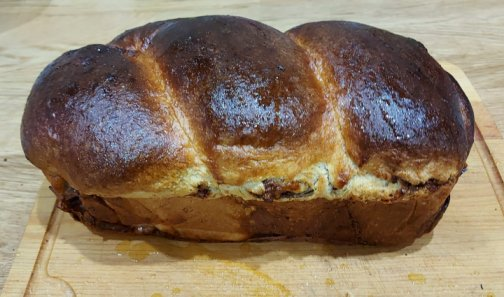

# Cozonac Usor de Facut

Folosind aceasta reteta puteti face 1.2 kg aluat de cozonac.
Acesta poate fi modelat intr-un cozonac mare. Daca aveti forme foarte mici puteti face 2.  
Reteta foloseste un aparat de facut paine sau un mixer cu bol, pentru a usura munca considerabil.  

## Cuprins

1. [Ingrediente](#ingrediente)
2. [Vase, ustensile si aparate](#vase-ustensile-aparate)
3. [Instructiuni](#instructiuni)
4. [Notite](#notite)

## Ingrediente

### Aluat

- 1 lingurita de sare
- 4 galbenusuri medii
- 150 g zahar
- 150 g unt/untura
- 300 ml lapte
- 600 g faina de paine
- 2 linguri extract vanilie/ 2 lingurite esenta vanilie
- 2 linguri rom / 2 lingurite esenta rom
- 2 pliculete de drojdie instant (14g)

### Umplutura

- 4 albusuri
- 50 g zahar
- 1 lingura cacao
- 1 strop esenta rom
- nuci
- rahat
- zahar

## Vase, ustensile si aparate

- Aparat de facut paine sau un mixer cu bol.
- 2 tavi de paine/cozonac
- 1 facalet

## Instructiuni

Adaugati toate ingredientele aluatului intr-un bol, in ordinea listata.

- Folosind aparatul de paine, setati programul pentru aluat si crescut, de 1 ora si jumatate. (Ex. Marca ambiano programul 17).  
- Alternativ framantati 15 min, folosind mixerul cu bol, incepand cu viteza cea mai mica si crescand treptat. Apoi acoperiti si lasati in loc caldut la crescut pentru 1 ora si 15 minute.

Cat aluatul creste, preparati umplutura. Taiati rahatul si nucile in bucatele mici.
Cand sunteti gata de modelat, bateti galbenusurile cu zaharul si cacaoa pana se face spuma tare.

Modelati cozonacul folosind facaletul si ulei. Faceti 2 rulouri cu umplutura la mijoc, gen clatite, puneti-le in forma impletite.  
Lasati in cuptor la creascut cu un ibric de apa fierbinte si cu becul cuptorului aprins, pentru 40-45 de minute.
Coaceti cozonacul 40-45 de minute in cuptor cu ventilator, la 180 de grade, tava pusa la mijloc sau putin mai jos.

Puteti testa daca este copt cu o scobitoare. Odata scos din cuptor el poate fi lasat 5 minute pe o parte pentru a nu se lasa.
Dizolvati putina miere in apa in proportie de 2:1. (2 parti de miere si una de apa). Ungeti partea de sus a cozonacului cu aceasta solutie, prevening uscarea lui si dand un aspect mai placut.

## Notite

Proportia de ingrediente este de 400 ml lichid la 600 g faina.  
Grasimile si galbenusurile se considera jumate din aportul de lichid.  
Becul cuptorului degaja caldura ce ajuta la cresterea aluatului.  
Daca drojdia e mai veche, o poti activa mai intai in putina apa cu zahar, pentru siguranta.
